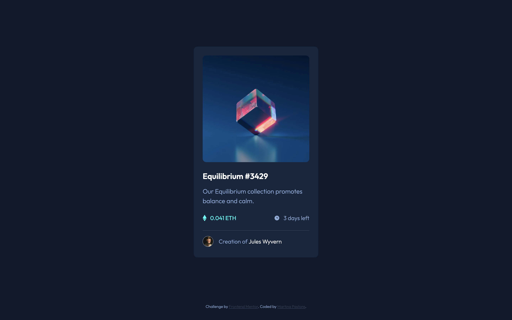

# Frontend Mentor - NFT preview card component solution

This is a solution to the [NFT preview card component challenge on Frontend Mentor](https://www.frontendmentor.io/challenges/nft-preview-card-component-SbdUL_w0U). Frontend Mentor challenges help you improve your coding skills by building realistic projects. 

## Table of contents

- [Overview](#overview)
  - [The challenge](#the-challenge)
  - [Screenshot](#screenshot)
  - [Links](#links)
- [My process](#my-process)
  - [Built with](#built-with)
  - [What I learned](#what-i-learned)
- [Author](#author)

## Overview

### The challenge

Users should be able to:

- View the optimal layout depending on their device's screen size
- See hover states for interactive elements

### Screenshot

### Links

- Live Site URL: [https://pastoremartina.github.io/NFTcardChallenge/](https://pastoremartina.github.io/NFTcardChallenge/)

### Built with

- Semantic HTML5 markup
- CSS custom properties
- Flexbox

### What I learned

As I'm just at the beginning of my learning journey, this project was a good challenge and taught me a lot.

The things I learned during this project go from very small (how to style the hr element) to a bit more complex (how to activate an overlay effect while hovering).

I used Flexbox in practice for the first time, and I think I'm getting the hang of it. 

## Author

- Frontend Mentor - [@PastoreMartina](https://www.frontendmentor.io/profile/PastoreMartina)
