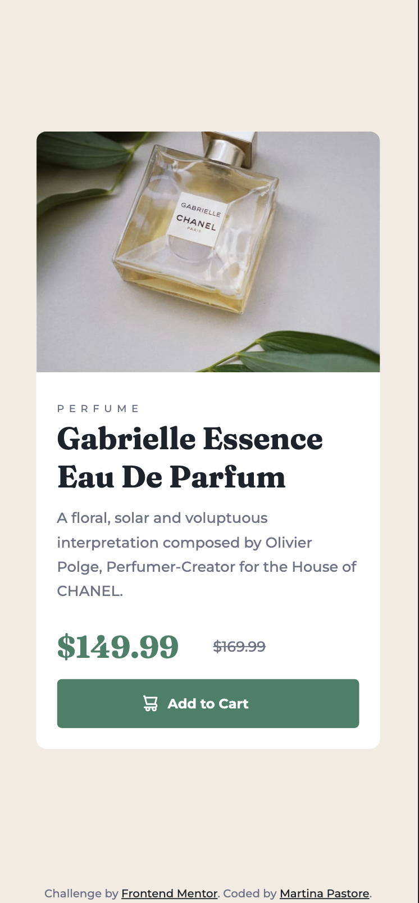

# Frontend Mentor - Stats preview card component solution

This is a solution to the [Stats preview card component challenge on Frontend Mentor](https://www.frontendmentor.io/challenges/stats-preview-card-component-8JqbgoU62). Frontend Mentor challenges help you improve your coding skills by building realistic projects. 

## Table of contents

- [Overview](#overview)
  - [The challenge](#the-challenge)
  - [Screenshot](#screenshot)
  - [Links](#links)
- [My process](#my-process)
  - [Built with](#built-with)
  - [What I learned](#what-i-learned)
  - [Continued development](#continued-development)
- [Author](#author)
- [Acknowledgments](#acknowledgments)

## Overview

### The challenge

Users should be able to:

- View the optimal layout depending on their device's screen size

### Screenshot




### Links

- Live Site URL: [https://pastoremartina.github.io/StatsCardChallenge/](https://pastoremartina.github.io/StatsCardChallenge/)

## My process

### Built with

- Semantic HTML5 markup
- CSS custom properties
- Flexbox
- Mobile-first workflow

### What I learned

With this project, I tried my hand for the first time with media queries and responsive design. 

I have learned about the ```<picture>``` tag and its uses for adjusting images to the device width. 

I have also learned about the ```mix-blend-mode``` property.

### Continued development

After using Flexbox for two challenges, it's finally time to try CSS Grid! 

## Author

- Frontend Mentor - [@PastoreMartina](https://www.frontendmentor.io/profile/PastoreMartina)

## Acknowledgments

I must thank again [Melvin Aguilar](https://github.com/MelvinAguilar) for their help and friendliness. 
