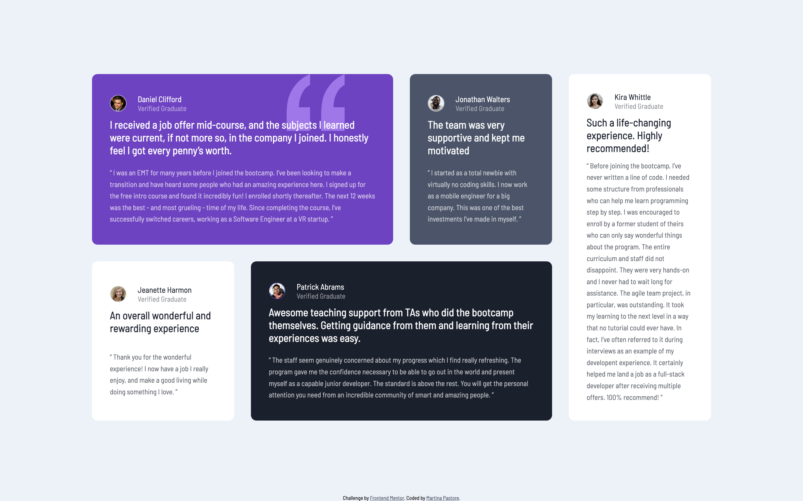

# Frontend Mentor - Testimonials grid section solution

This is a solution to the [Testimonials grid section challenge on Frontend Mentor](https://www.frontendmentor.io/challenges/testimonials-grid-section-Nnw6J7Un7). Frontend Mentor challenges help you improve your coding skills by building realistic projects. 

## Table of contents

- [Overview](#overview)
  - [The challenge](#the-challenge)
  - [Screenshot](#screenshot)
    - [Desktop](#desktop)
    - [Mobile](#mobile)
  - [Links](#links)
- [My process](#my-process)
  - [Built with](#built-with)
  - [What I learned](#what-i-learned)
- [Author](#author)

## Overview

### The challenge

Users should be able to:

- View the optimal layout for the site depending on their device's screen size

### Screenshot

#### Desktop

#### Mobile

### Links

- Live Site URL: [https://pastoremartina.github.io/TestimonialGridChallenge/](https://github.com/PastoreMartina/TestimonialGridChallenge)

## My process

### Built with

- Semantic HTML5 markup
- CSS custom properties
- Flexbox
- CSS Grid

### What I learned

I got more familiar with CSS Grid, and how to use it coupled with Flexbox. It was a project with a layout a bit more complex than the previous challenges I completed, and I'm happy with the results. I can see my progress and this is a huge help for my motivation.

I didn't use the "Mobile first" approach because I was more focused on nailing the desktop grid layout.

## Author

- Frontend Mentor - [@PastoreMartina](https://www.frontendmentor.io/profile/PastoreMartina)
